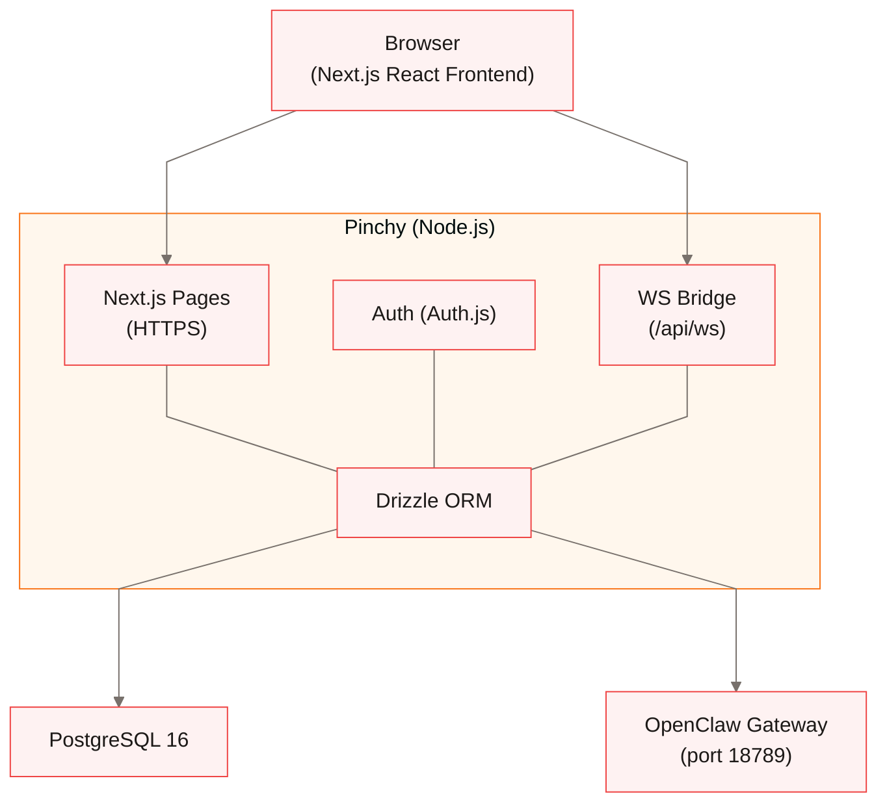

## Overview

Pinchy is **not a fork** of OpenClaw. It's a governance layer on top of it. OpenClaw handles agent execution, tool use, and model communication. Pinchy adds authentication, provider management, agent permissions, cryptographic audit trails, and (soon) team management.

## Request flow

When a user sends a message, it flows through three layers:

1. **Browser** → connects via WebSocket to `/api/ws` on Pinchy, sending a JSON message with `type`, `content`, and `agentId`
2. **Pinchy** → authenticates the user, verifies agent access, resolves the **session key** from the in-memory session cache, generates a message ID, and forwards the message to OpenClaw Gateway with the `agentId` and `sessionKey`
3. **OpenClaw** → routes the message to the correct agent from its config, processes it through the configured model, and streams the response back
4. **Pinchy** → attaches the message ID and forwards each chunk to the browser
5. **Browser** → renders the streaming response in real time

Each browser connection gets its own `ClientRouter` instance that manages agent access checks and session resolution. Pinchy acts as a bridge — it never interprets or modifies the AI response content.

### Agent routing

When a message arrives, the `ClientRouter` passes the `agentId` from the browser message to OpenClaw via `chatOptions`. OpenClaw uses this to select the matching agent from its `agents.list[]` config — each agent can have its own model, system prompt, tools, and workspace.

### Chat sessions

Pinchy derives a deterministic session key for each `(agentId, userId)` pair using the format `agent:<agentId>:user-<userId>`. This gives each user their own conversation per agent — even for shared agents. Session keys are resolved in-memory via a `SessionCache` that periodically syncs with OpenClaw's session list — no database table is needed. The session key is opaque and never leaves the server — the browser only sends an `agentId`, and Pinchy resolves the session internally.

The browser can request conversation history by sending a `{ type: "history", agentId }` message. Pinchy fetches the history from OpenClaw via `openclaw-node` and strips internal metadata (timestamps, thinking blocks) before returning it.

### Session key naming convention

Session keys follow the format `agent:<agentId>:<scope>`. OpenClaw validates that the `agentId` segment matches the `agentId` parameter passed to `chat()` — a mismatch causes silent failures (history not loaded, messages not sent).

**Current format:**

| Scope             | Key format                      | Example                                |
| ----------------- | ------------------------------- | -------------------------------------- |
| Per-user sessions | `agent:<agentId>:user-<userId>` | `agent:83aa6035-...:user-8c0953d2-...` |

This format is used for both personal and shared agents. Each user always gets their own session, which means converting a personal agent to a shared agent is seamless — the original user keeps their session, and other users get new ones.

**Planned formats (not yet implemented):**

| Scope            | Key format                      | Example                               | Use case                   |
| ---------------- | ------------------------------- | ------------------------------------- | -------------------------- |
| Cron jobs        | `agent:<agentId>:cron-<jobId>`  | `agent:83aa6035-...:cron-daily-check` | Scheduled agent actions    |
| Webhook triggers | `agent:<agentId>:hook-<hookId>` | `agent:83aa6035-...:hook-slack-alert` | Event-driven agent actions |

The `agentId` segment must always be the Pinchy agent UUID. The `scope` segment is free-form but should follow the patterns above for consistency.

### Session lifecycle and compaction

Sessions grow with each message. OpenClaw tracks the full conversation in JSONL files and sends the relevant context to the LLM provider with each request. Over time, this increases token usage and cost.

OpenClaw handles this via **compaction** — automatic summarization of older messages when the context window approaches its limit. Pinchy's OpenClaw config uses `"compaction": { "mode": "safeguard" }`, which means OpenClaw compacts automatically as a safety measure. There is also an explicit `sessions.compact(key, { maxLines })` API for manual compaction.

Sessions track a `compactionCount` to record how many compactions have occurred. The impact on `sessions.history()` output after compaction (whether summaries appear as regular messages or a special type) is an open question that will be addressed when sessions grow large enough to trigger it.

## Authentication

Pinchy uses [Auth.js v5](https://authjs.dev/) with a credentials provider:

- Passwords are hashed with **bcrypt** before storage
- Sessions use **JWT** strategy (stateless, no server-side session store)
- JWTs carry the user's **role** (`admin` or `user`) for authorization checks
- The first user created via the setup wizard becomes the admin
- All app routes require authentication — unauthenticated requests redirect to `/login`

### Roles

Pinchy has two roles:

- **Admin** — can manage agents, users, invites, and settings
- **User** — can chat with agents and update their own profile

### Invite system

Admins invite new users by generating an invite token:

1. Admin creates an invite for an email address via **Settings → Users**
2. Pinchy generates a random token, stores its **SHA-256 hash** in the database, and returns the plaintext token as a one-time invite link
3. The invite recipient opens the link, sets their name and password, and their account is created
4. A personal **Smithers** agent is automatically created for the new user
5. Invite tokens expire after **7 days** and are single-use

## Permission layer

Pinchy uses an **allow-list** model for agent permissions: agents have **no tools by default**. Admins explicitly enable tools for each agent via the Permissions tab in Agent Settings.

Tools are organized into two categories:

- **Safe tools** — sandboxed directory access (`pinchy_ls`, `pinchy_read`). Only work within directories the admin has approved.
- **Powerful tools** — direct server access (shell commands, unrestricted file access, web access). Only for trusted use cases.

When an agent has safe tools enabled, the `pinchy-files` plugin validates every file access request against the agent's allowed directories, with symlink resolution to prevent escapes.

All agent-accessible files live under `/data/` in the container, mounted via Docker volumes. This means even if all software layers failed, the agent can only see files that were explicitly mounted.

### Agent access control

Pinchy restricts which agents a user can see:

- **Admins** can access all agents (personal and shared)
- **Users** can access shared agents and their own personal agent
- Only admins can view and modify agent permissions

For the full details, see [Agent Permissions](/concepts/agent-permissions/).

## Database

PostgreSQL 16, accessed via [Drizzle ORM](https://orm.drizzle.team/). The schema includes:

- **Auth tables** — `user`, `account`, `session`, `verificationToken` (managed by Auth.js adapter)
- **`agents`** — Agent configuration (name, model, template, allowed tools, plugin config, owner)
- **`invites`** — Invite tokens (SHA-256 hashed token, email, expiry, status)
- **`settings`** — Key-value store for app configuration (provider keys, onboarding state)
- **`auditLog`** — Append-only audit trail with HMAC-SHA256 signed rows, protected by PostgreSQL triggers preventing UPDATE and DELETE

Migrations are generated with `drizzle-kit generate` and applied automatically on container startup via `drizzle-kit migrate`.

## Encryption

Provider API keys are encrypted at rest using **AES-256-GCM**:

- A 256-bit encryption key is either provided via the `ENCRYPTION_KEY` environment variable or auto-generated and persisted in the `pinchy-secrets` Docker volume
- Each encrypted value stores the IV, auth tag, and ciphertext together
- Decryption happens on-demand when Pinchy writes the OpenClaw configuration file

## Audit Trail

Pinchy includes a cryptographic audit trail for compliance and security. Every significant action is logged to the `auditLog` table with an HMAC-SHA256 signature.

### Design principles

- **Append-only** — PostgreSQL triggers prevent UPDATE and DELETE operations on audit rows. Once written, entries are immutable.
- **Cryptographically signed** — Each row is signed with HMAC-SHA256 using a server-side secret (auto-generated if not provided via `AUDIT_HMAC_SECRET`).
- **Fire-and-forget** — Audit logging never blocks or breaks the main operation. If logging fails, the original action still succeeds.
- **Admin-only access** — Only admins can view, verify, or export the audit log.

### What gets logged

Pinchy logs 12 event types covering authentication, agent management, user management, configuration changes, and tool execution. Chat message content is **not** logged — only tool calls and permission-relevant actions.

### Integrity verification

Admins can verify the integrity of audit entries via the admin UI or the `/api/audit/verify` endpoint. Verification recomputes HMAC signatures and reports any tampered rows.

### CSV export

The audit log can be exported as CSV for compliance reporting via the admin UI or the `/api/audit/export` endpoint.

For the full details, see [Audit Trail](/concepts/audit-trail/).

## OpenClaw integration

OpenClaw runs as a separate Docker container. Pinchy communicates with it via `openclaw-node` (the official Node.js client) over WebSocket on port 18789. The browser never connects to OpenClaw directly.

### Config generation

Pinchy owns the OpenClaw configuration file (`openclaw.json`). Config generation happens in two scenarios:

1. **Initial setup** — during the onboarding wizard, `writeOpenClawConfig()` writes the first config with provider credentials and a randomly generated auth token
2. **Regeneration** — whenever agents, permissions, or providers change, `regenerateOpenClawConfig()` rebuilds the config from DB state

Regeneration is **idempotent**: it preserves only the `gateway` block (which contains the auth token and OpenClaw-generated fields) and rebuilds everything else — `env`, `agents`, and `plugins` — from the database. This ensures deleted providers and agents are cleaned up automatically.

An inotify-based wrapper script inside the OpenClaw container detects the config change and restarts the gateway automatically.

### Authentication

Pinchy authenticates to OpenClaw Gateway using a bearer token. The token is auto-generated on first setup via `crypto.randomBytes(24)` and stored in the `gateway.auth` block of `openclaw.json`. It never appears in source control.

## Tech stack

| Layer         | Technology                                       |
| ------------- | ------------------------------------------------ |
| Frontend      | Next.js 16, React 19, Tailwind CSS v4, shadcn/ui |
| Chat UI       | assistant-ui (React)                             |
| Auth          | Auth.js v5 (credentials provider, JWT sessions)  |
| Database      | PostgreSQL 16, Drizzle ORM                       |
| Agent runtime | OpenClaw Gateway (WebSocket)                     |
| Encryption    | AES-256-GCM (Node.js crypto)                     |
| Testing       | Vitest, React Testing Library                    |
| CI/CD         | GitHub Actions, ESLint, Prettier                 |
| Deployment    | Docker Compose                                   |
| License       | AGPL-3.0                                         |
